# Justification and Comparisons
The primary font colour for this website prototype was set to #13193F (a deep navy blue) rather than black because it follows the oceanic / island colour theme I intended this website to have, and the deep navy blue colour still has a high enough contrast with the rest of the website content, such as the background colour of paragraphs of information.

I chose for the background colour for each paragraph of information on the website to be a light beige colour with a lowered opacity such that it creates contrast and allows for better readability of the dark coloured text above the busy background images of Cheung Chau, while the slightly lowered opacity still allows the user to see the background images provided through the paragraph.

## Navigation Bar
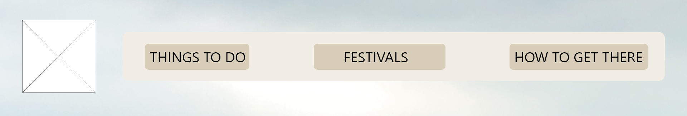
> Mockup design of the navigation bar 

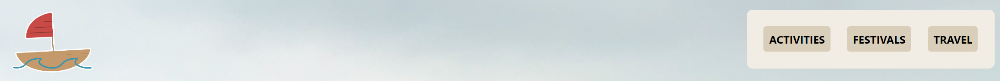
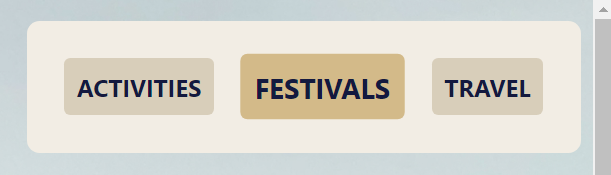
> Website prototype of the navigation bar; Second image shows the navigation bar button behaviour on hover

Instead of having the navigation bar span across the whole page horizontally, I coded it to stay in the top right corner of the page as the user scrolls, such that it is accessible at all times and allows for easy navigation. I also made it smaller in the prototype compared to the design so that it takes up less screen space, and lets the user see the background images I have set which shows what Cheung Chau looks like as they scroll. As well as that, I chose to make the buttons on the navigation bar (as well as the logo which acts as the Homepage link) scale up in size when the user's cursor hovers over it & change to a darker contrasting colour, as a form of visual feedback for the user and better indicates that the object is clickable. 

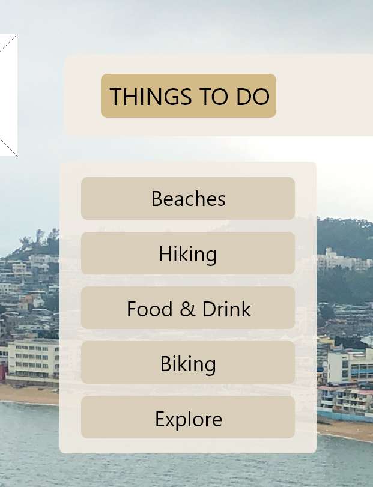
> Mockup of the dropdown menu for the Activities list, including hyperlinks for different sections of activities.html

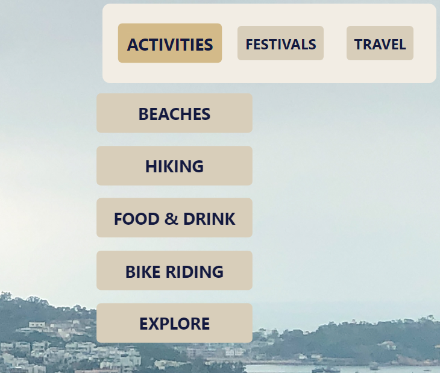
> Prototype of the dropdown menu for the Activities hyperlinks

While implementing the dropdown menu for the Activities page, I wanted to keep the same 'floating' design as the mockups (the dropdown menu apears on cursor hover, but the block is separated from the navigation bar by a visible amount), however, it makes clicking the hyperlinks impossible because the dropdown menu does not say active once the cursor moves away from the 'ACTIVITIES' button. To remedy this, I made the colour for the padding around the dropdown menu links 0% opacity such that the padding still exists and allows for users to hover over all the links properly without the menu disappearing but the dropdown menu now appears as intended based on the mockup design (CSS below).
```CSS
.dropdown:hover .activitiesContent {
    background-color: rgba(216, 206, 186, 0.0);
    padding: 25px 25px;
}
```

## Footer
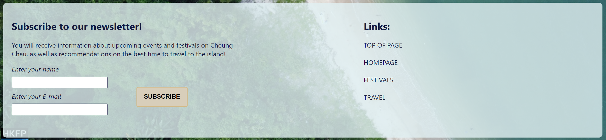
> Website prototype of the footer

I did not include a footer in my design proposals and mockups, but I chose to implement a footer in the website prototype where it allows for users to subscribe to a newsletter which offers updates about Cheung Chau and travel deals. Similarly, the submission button for this newsletter form also scales up in size like the navigation bar when the cursor hovers over it to provide feedback to the user that the object is interactable.

## Homepage Prototype
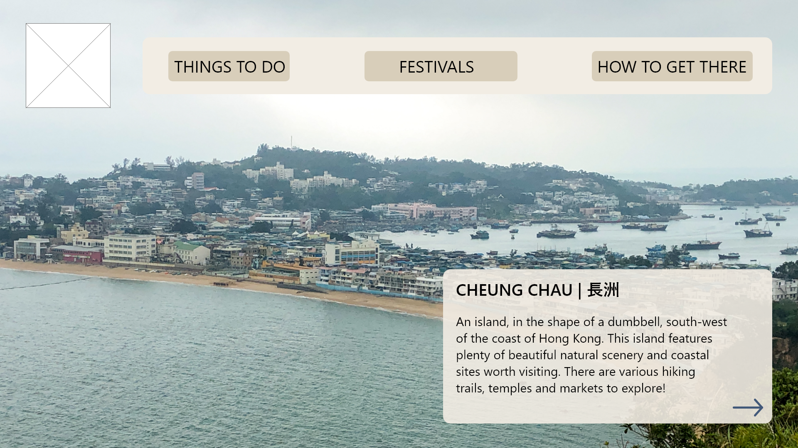
> Mockup design of the homepage


> Prototype of the homepage

I moved the location of the about information paragraph to the left corner in the web prototype because I found that it had better readability in that location, even with the coloured rectangle as it rests on a less busy section of the background image which makes it easier for the user's eyes to focus on when they arrive on the homepage. The about Cheung Chau paragraph was also moved to the left because I had difficulties while trying to code the placement of the paragraph on the right side of the page.

## Activities Prototype
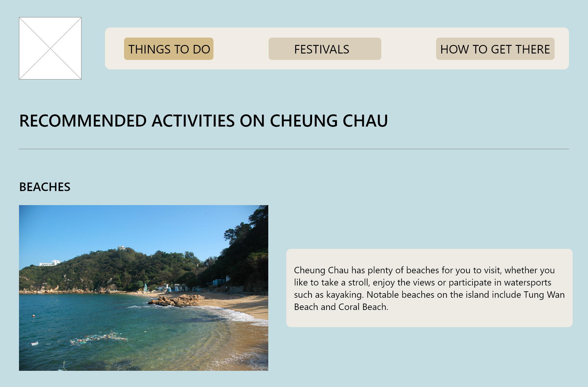
> Mockup design of the activities page (rest of the page is not shown)

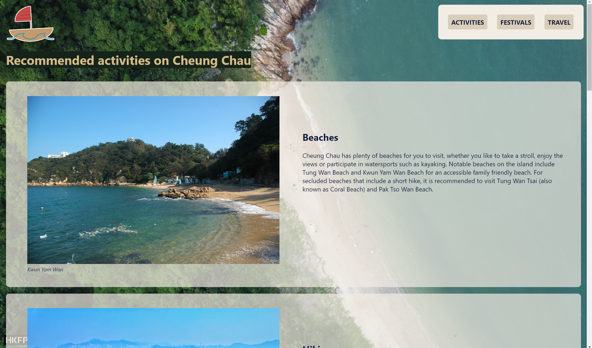
> Prototype of the activities page 

I added an image of Cheung Chau to the background in the web prototype, differing from the design proposal because the static colour background appeared to be too simple & not interesting enough for visual aesthetics. I chose an image that still allows the audience to be able to read the information on the right side of the page, along with each section of information including a coloured rectangle as a background.

## Festivals Prototype
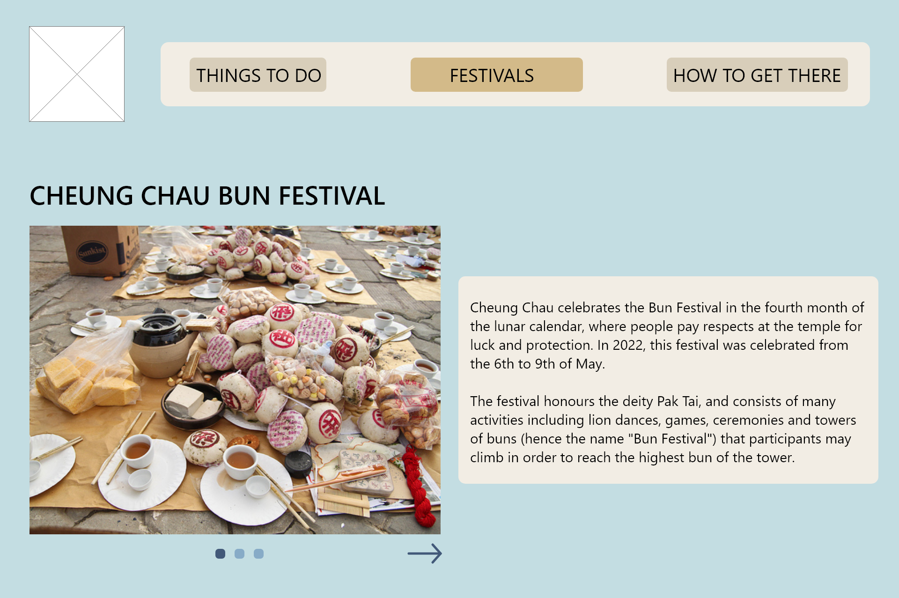
> Mockup design of the festivals page


> Prototype of the festivals page

Similar to the Activities page, I added the same image of Cheung Chau as a background image in the website prototype to make it more eye catching to the user as they scroll. Following tutor feedback, this change was made to the static colour background in order to create a better sense of consistency with the other pages (Homepage and How to Travel page) as they have their own background images which helps with the user's immersion while scrolling and reading about Cheung Chau.

On both the Activities page and the Festivals page, I used ```<mark>``` to highlight the top heading in a solid dark green colour, with the same dark beige from the navigation bar to keep the colour scheme consistent as well as create enough contrast between the background and the foreground text, as without the solid colour to highlight the heading, it is very hard to read the heading properly due to the background image being multiple shades of colours in the top left corner. 

## Travel Prototype
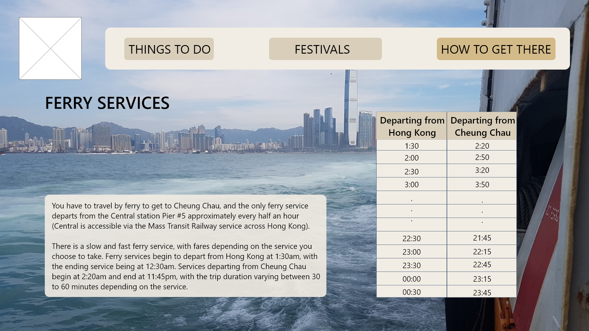
> Mockup of the travel information page

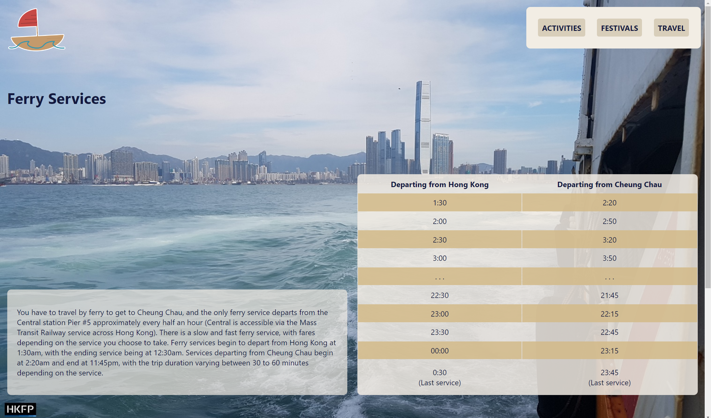
> Prototype of the travel information page

This page remained largely the same between mockup and the working prototype. Using grids to position the information on the page allowed for me to easily place the paragraph of information on the bottom left side of the page, while also keeping the example timetable on the right side of the page. The timetable is a lot larger than the mockup design for greater visibility, along with the alternating row colours to better distinguish between rows of information 

# Further Iterations & Improvements

A notable improvement to be made would be to make the dropdown menu have greater contrast on the homepage, so that it has greater visibility when the user hovers over it. Furthermore, I think there are improvements that can be made to the dropdown menu when hovering over it on the other pages, such as on the activities page, as it lacks enough contrast with the other content on the page.

In future interations, I would aim to work on the placement of the logo/homepage button, as it is currently placed at the top of the page, and not with the rest of the navigation bar, which means that the user has to scroll to the top of the page to access the homepage button again (or they can use the links in the footer), but the current placement is not ideal. I did not implement the placement of the logo with the rest of the navigation bar in this current prototype due to some CSS styling issues that I was not able to work through. 

Finally, there are some issues with the images placed in the sections of information, where the image remains at the top of the block and there is too much empty space at the bottom of the block at some resolutions and dimensions when the website is viewed; thus this could be solved/improved in later iterations to make for a smoother user experience.

# REFERENCE LIST
Audiger, S. (n.d.). 4 Great Restaurants in Cheung Chau. Retrieved from https://au.hotels.com/go/hong-kong/best-cheung-chau-restaurants 

Bayview Chinese Restaurant [Image] (n.d.). Retrieved from https://au.hotels.com/go/hong-kong/best-cheung-chau-restaurants _(location: activities.html)_

Cheung Chau [Image] (2018). Retrieved from https://www.flickr.com/photos/fran001/30979379467/ _(location: home.html)_

Cheung Chau | Hong Kong Tourism Board. (n.d.). Retrieved from https://www.discoverhongkong.com/anz/explore/great-outdoor/wellness/cheung-chau.html 

Cheung Chau Sun Hing Praya Street n Typhoon Shelter [Image] (2008). Retrieved from https://commons.wikimedia.org/wiki/File:HK_Cheung_Chau_Sun_Hing_Praya_Street_n_Typhoon_shelter_2.JPG  _(location: activities.html)_

Food offerings [Image] (n.d.). Retrieved from https://www.hong-kong-traveller.com/cheung-chau-bun-festival.html _(location: festivals.html)_

How TO - Hoverable Dropdown. (n.d.). Retrieved from https://w3schools.com/howto/howto_css_dropdown.asp 

Kwun Yam Wan, Cheung Chau (Hong Kong) [Image] (2013). Retrieved from https://commons.wikimedia.org/wiki/File:Kwun_Yam_Wan,_Cheung_Chau_(Hong_Kong).jpg _(location: activities.html)_

A Local Guide to Cheung Chau Island Hong Kong. (2019). Retrieved from https://www.trip.com/blog/guide-to-cheung-chau-island-hong-kong/ 

Nice Temple [Image] (2010). Retrieved from https://www.flickr.com/photos/jamescridland/5284901658/ _(location: activities.html)_

North Lookout Pavilion [Image] (n.d.). Retrieved from https://au.hotels.com/go/hong-kong/best-cheung-chau-things-to-do _(location: activities.html)_

Rebane, T. (2021). HKFP Guide: Cheung Chau – Hong Kong island getaway, home to street food, family-friendly hikes and great beaches. Retrieved from https://hongkongfp.com/2021/12/04/hkfp-guide-cheung-chau-hong-kong-island-getaway-home-to-street-food-family-friendly-hikes-and-great-beaches/ 

Tom Grundy/HKFP [Image] (2021). Retrieved from https://hongkongfp.com/2021/12/04/hkfp-guide-cheung-chau-hong-kong-island-getaway-home-to-street-food-family-friendly-hikes-and-great-beaches/ _(location: travel.html)_

Tung Wan Tsai (Coral Beach) Tom Grundy/HKFP [Image] (2021). Retrieved from https://hongkongfp.com/2021/12/04/hkfp-guide-cheung-chau-hong-kong-island-getaway-home-to-street-food-family-friendly-hikes-and-great-beaches/ _(location: activities.html)_